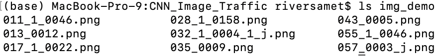
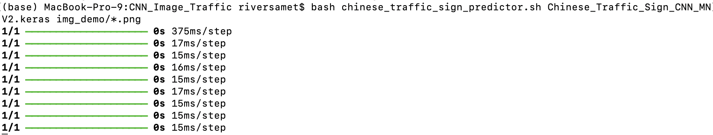
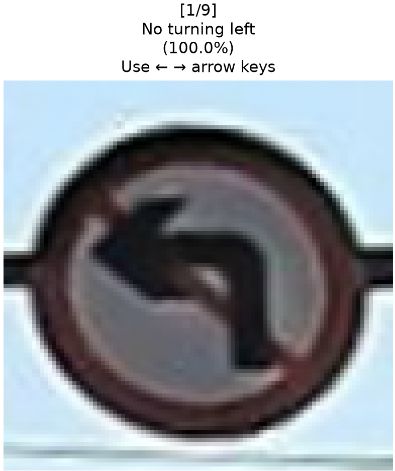
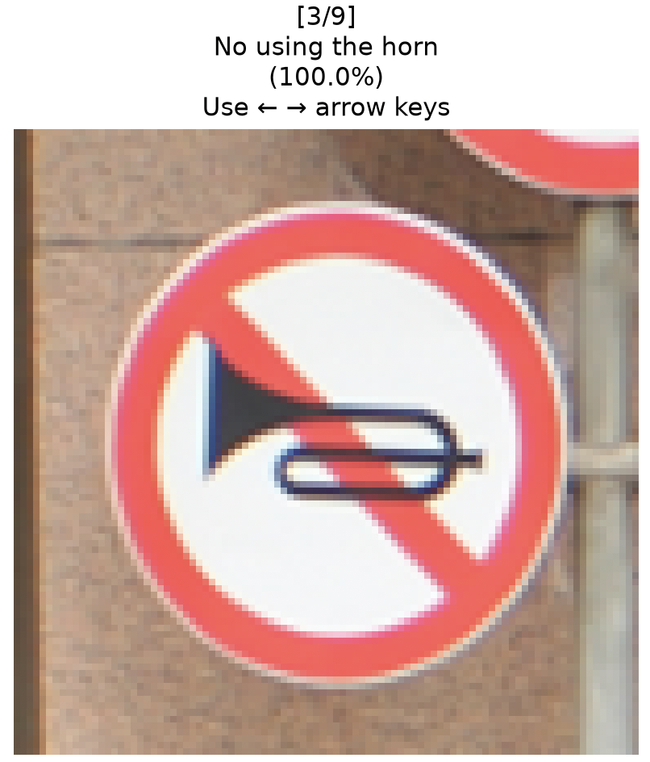

# CNN Image Classification Project

This project explores the use of convolutional neural networks (CNNs) to classify Chinese traffic sign images using a dataset downloaded from Kaggle. Multiple CNNs are tested, including one with augmented training data, and another as a transfer learning model. In total, four different CNNs are built, trained, and evaluated, and results are compared for each. The best model is subsequently implemented in a Python script with a Bash wrapper for quick, interpretable, and human-readable traffic sign predictions based on user-input images.

## Objectives

- Preprocess data properly for CNN input
- Build, train, and test multiple CNNs
- Explore the effect of data augmentation on results specifically for the dataset used in this project
- Determine performance of Google's widely-used MobileNetV2 CNN model with this dataset; compare with and without trainable parameters in the base model
- Save CNNs to disk
- Implement saved CNNs in user-friendly scripts that can provide clear, comprehensible, and interpretable image predictions.

## Tools and libraries

- Python
- Kagglehub
- pandas
- ipywidgets
- scikit-learn
- PIL
- matplotlib
- NumPy
- TensorFlow
- seaborn

## Description

### 1. Import data and create training, validation, and testing splits

#### Downloading the dataset

The `kagglehub` API is used to directly download the dataset used for this project to disk. In total, 6164 images of Chinese traffic signs split into 58 different categories are present in this dataset.

#### Create training, validation, and testing splits for the data

A ~70/15/15 split was used for this project. Stratification is used across splits to preserve class distributions; some traffic sign types appear more frequently than others.

### 2. Preprocess the data

The typical shape of an image object for CNN training is (`image_width`, `image_height`, `number_of_color_channels`). 

- Three color channels are created using `RGB`
- Images are resized to 32x32
- Image object color ranges are normalized so that they range from 0 to 1

### 3. Building, training, and evaluating CNNs

CNNs are used specifically for this image classification project because of their heightened ability to learn spatial patterns compared to other types of machine learning models. 

#### Building the models

Four different CNNs are built, trained, and evaluated in this project. The first two consist of three convolutional layers with a pooling layer after each, flattening to reshape the final hidden layer to one dimension, a dense layer for final classification, and a softmax activation function in the dense layer to provide probabilities of sign type for each image by the model.

One of these CNNs also contains data augmentation for the training set.

The other two CNNs are based on Google's MobileNetV2 (MNV2) available directly from TensorFlow. One is simply the base model with no trainable parameters, followed by global pooling and a final dense layer for classification, and the other has the same structure but with the final 10 layers being trainable.

#### Compiling and training the models

The optimizer, loss function, and batch size chosen for each model are all standard for basic CNN usage.

A large number of epochs (50) were used to train all models in this project because `callbacks.EarlyStopping` was also used, with `restore_best_weights=True`.

#### Evaluating model performance

Each model's performance is evaluated based on predictions on the validation and test sets. Overall accuracy of test set predictions is used as the primary indicator of model performance.

Overall, the basic CNN model had validation and test set prediction accuracies of 95% and 96%, respectively, the model using augmented training data had accuracies of 68%, MNV2 with no trainable parameters in the base model had accuracies of 98%, and MNV2 with trainable parameters in the base model had accuracies of 98%. 

The poor performance of the model with augmented training data is likely due to minimal overfitting in the original model, which means that clouding the already-strong training signal with augmented data only lowers accuracy. 

All other models had consistent and high recall, precision, and F1 scores across the board, with confusion matrices that showed near-perfect diagonals. All of this indicates that there was not a specific category of sign that confused models, but any inaccuracy by the model was generally distributed smoothly across multiple sign categories.

### 4. Saving the best performing model

The final model selected for subsequent steps was the final model tested (transfer learning model; MNV2 with trainable parameters in the base layer). This model was saved to disk and is shared in this repository.

### 5. Implementation of selected model in Python script

Following model evaluation, the best model was implemented in a Python script with an optional Bash wrapper that provides interpretable, human-readable, and efficient Chinese traffic sign predictions based on user-input images.

#### Basic script usage

To run the prediction pipeline properly, follow these steps:

1. Download the .keras CNN model file included in this repository.

2. Download the selected Chinese traffic sign images you would like to make predictions on (either from this repository, or from elsewhere) and put them into one directory. An example is shown below.

3. Download `Chinese_Traffic_Sign_Predictor.py` and optionally `chinese_traffic_sign_predictor.sh`, as well as `labels.py` and place them all in one directory.

4. Run either `python3` `/path/to/Chinese_Traffic_Sign_Predictor.py` `/path/to/model` `/path/to/image_directory/*.png`,

OR

`bash` `/path/to/chinese_traffic_sign_predictor.sh` `/path/to/model` `/path/to/image_directory/*.png`. You will receive a `matplotlib.pyplot` pop-up window that contains each traffic sign image that you provided, the predicted class, and a confidence level. Use the arrow keys on your keyboard to shift between signs that you provided. An example is shown below.

Loading the pop-up (above).

Results appear in the pop-up as shown above.